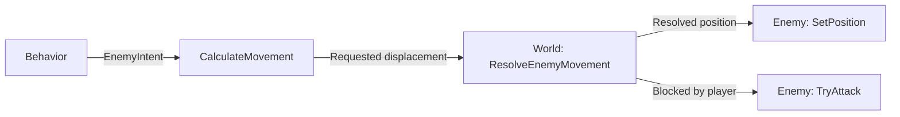

# Depthline

English | [Русский](README_ru.md)

A top-down action game prototype built with **C++23**, **SFML 3.1.0**, and **CMake**.

Depthline is a personal project focused on reusable combat systems and component-based game objects. The current prototype includes mouse-directed melee combat, pursuing enemies, and tile-based collision. The longer-term direction is a bullet hell game with ranged weapons and projectile patterns.

**Status:** early development. Gameplay currently uses geometric shapes and visible attack hitboxes; sprites, a health HUD, and projectiles are planned.

## Current Gameplay

- **Independent movement and aiming:** WASD movement with normalized diagonal speed; mouse coordinates are converted into world coordinates using the camera view.
- **Melee combat:** the player's sword creates five rectangular hitboxes arranged relative to the aiming direction. Each attack damages a given enemy at most once.
- **Contact attacks:** a pursuing enemy attempts an attack when its movement is blocked by the player. A directional hitbox determines whether the attack connects, and a cooldown limits attack frequency.
- **Health and death:** defeated enemies are removed from the world. When the player dies, world updates stop; the scene remains visible.
- **Tile maps:** maps define walls, floors, and spawn points. Movement is resolved separately along the X and Y axes, allowing movement along obstacles.
- **Camera and rendering:** fullscreen display, a camera that follows the player, and temporary visualizations of the actual attack hitboxes.

The included map contains one player and one chasing enemy. The player is green, the enemy is red, sword hitboxes are translucent white, and contact attack hitboxes are magenta.

## Controls

| Input | Action |
| --- | --- |
| W / A / S / D | Move |
| Mouse | Aim |
| Left mouse button | Attack; holding the button repeats attacks as the cooldown permits |
| Desktop close-window shortcut | Exit |

Dash input is reserved on Left Shift, but the dash mechanic is not implemented yet. There is no pause menu or in-game restart; after death, close and relaunch the application.

## Build and Run

The instructions below target Linux. The current CMake configuration uses GCC/Clang-style warning flags; builds on other platforms have not been verified.

### Requirements

- A C++ compiler and standard library supporting C++23, plus a C compiler for dependencies.
- CMake **3.28 or newer**, Git, and Make or Ninja.
- A graphical desktop with OpenGL support.
- SFML's system libraries and development headers: X11, Xrandr, Xcursor, Xi, udev, OpenGL, FreeType, HarfBuzz, FLAC, Ogg, and Vorbis. Package names depend on the distribution; see the [SFML 3.1 build instructions](https://www.sfml-dev.org/tutorials/3.1/getting-started/build-from-source/#installing-dependencies).

CMake downloads SFML at the pinned `3.1.0` tag through `FetchContent`, so installing SFML itself separately is unnecessary. The initial configuration requires internet access to fetch dependencies. The project currently links SFML Graphics and Audio; networking is disabled.

### Commands

```sh
git clone https://github.com/Arsushaaa/MyGame.git Depthline
cd Depthline

mkdir -p assets
cmake -S . -B build -DCMAKE_BUILD_TYPE=Release
cmake --build build
./build/bin/Depthline
```

The `assets` directory is currently empty and is not tracked by Git. Creating it is required because the existing post-build step copies that directory next to the executable. The prototype does not require external textures or fonts.

For a debug build, configure with `-DCMAKE_BUILD_TYPE=Debug`. CMake also generates `build/compile_commands.json` for editor tooling. If an existing build directory uses a different generator, choose a new build directory rather than reusing its cache.

## Architecture

Game objects use composition: an enemy's behavior, appearance, collision bounds, and weapon can be configured separately. Factories assemble concrete combinations, while `World` coordinates interactions between entities.

| Module | Responsibility |
| --- | --- |
| [`Game`](src/Core/Game.cpp) | Owns the window, game loop, and camera; converts mouse position into world coordinates |
| [`PlayerCommand`](include/Depthline/Input/PlayerCommand.hpp) | Carries input state and an aiming target from the input layer to the world |
| [`World`](src/World/World.cpp) | Owns the player, enemies, and map; resolves movement, applies attack results, and removes defeated enemies |
| [`TileMap`](src/World/TileMap.cpp) | Validates map data, extracts spawn points, draws tiles, and checks wall collisions |
| [`Player`](src/Entities/Player.cpp) | Stores player state and owns the player's weapon |
| [`Enemy`](src/Entities/Enemy/Enemy.cpp) | Stores enemy state, delegates decisions to a behavior, and owns its components and weapon |
| [`Weapon`](src/Entities/Weapon/Weapon.cpp) | Coordinates attack generation, usage restrictions, and visual feedback |

### Enemy Composition

An enemy combines three interfaces from [`EnemyComponents.hpp`](include/Depthline/Entities/Enemy/EnemyComponents.hpp), plus a `Weapon`:

| Component | Contract | Current implementation |
| --- | --- | --- |
| Behavior | Produces an `EnemyIntent` containing movement and aiming directions | `ChaserBehavior` |
| Visual | Displays the enemy and receives position/facing updates | `RectangleEnemyVisual` |
| Collider | Provides bounds at a proposed position | `BoxEnemyCollider` |

Deciding where to move and deciding whether movement is possible are separate operations:



The behavior receives an `EnemyBehaviorContext` with the two positions and frame time. It does not directly move the enemy or apply damage. `World` checks the map and the player before accepting the requested movement.

### Shared Weapon System

Both the player and each enemy own a `Weapon`. Its three components are defined in [`WeaponComponents.hpp`](include/Depthline/Entities/Weapon/WeaponComponents.hpp):

| Component | Responsibility | Current implementations |
| --- | --- | --- |
| `IWeaponAttackPattern` | Builds hitboxes and damage values from the owner's position, bounds, and aim | `BaseSwordPattern`, `ContactAttackPattern` |
| `IWeaponUseLimiter` | Determines whether the weapon can be used and updates its cooldown | `CooldownLimiter` |
| `IWeaponVisual` | Displays the weapon or an attack effect | `HitboxAttackVisual` |

An attack follows this sequence:

1. The owner constructs a `WeaponUseContext` and calls `Weapon::TryUse()`.
2. The limiter checks whether the weapon is ready. If it is blocked, `TryUse()` returns `std::nullopt`.
3. The attack pattern builds a `WeaponAction` containing hitboxes and damage values.
4. The limiter starts its cooldown, and the visual receives the same action through `OnUse(action)`.
5. The owner returns the action to `World`, which checks targets and applies damage.

This keeps attack geometry in one place: the debug visual draws the hitboxes generated by the attack pattern. Damage is evaluated once when the action is processed; the short display timer does not cause repeated damage.

### Ownership and Extension

Components use `std::unique_ptr` to express exclusive ownership. `Enemy` and `Weapon` are movable and non-copyable, so their state and components are transferred explicitly rather than duplicated. Factories centralize component selection and parameters.

- To add an enemy behavior, implement `IEnemyBehavior` and select it in [`EnemyFactory`](src/Entities/Enemy/EnemyFactory.cpp). Existing visuals, colliders, and weapons can be reused.
- To add a hitbox-based weapon, implement `IWeaponAttackPattern` and assemble it in [`WeaponFactory`](src/Entities/Weapon/WeaponFactory.cpp). The cooldown and hitbox visual can stay the same.
- To add sprite rendering, provide a new visual implementation while retaining the existing behavior or attack pattern.

The current `WeaponAction` supports rectangular hitboxes. Projectile weapons will also need projectile spawning and updates in the world. SFML types are used throughout the gameplay interfaces; the project does not currently have a renderer-independent simulation layer.

## Project Layout

```text
app/main.cpp                     Application entry point
include/Depthline/               Public declarations
    Core/                       Game loop and window
    Input/                      Input commands and bindings
    World/                      World, tile map, and map definitions
    Entities/                   Player
        Enemy/                  Enemy components and factory
        Weapon/                 Weapon components and factory
src/                            Implementations, mirroring include/Depthline
CMakeLists.txt                  Build configuration and dependencies
```

The level is defined in [`Maps.hpp`](include/Depthline/World/Maps.hpp) using `#` for walls, `.` for floor, `P` for the player spawn, and `E` for a chasing enemy spawn. Rows must have equal width and contain exactly one player spawn. Invalid maps are rejected with an exception. Editing a map currently requires recompilation.

## Current Scope and Next Steps

Only the chasing behavior is implemented. `Shooter` and `Jumper` are reserved enum values and currently use the same factory configuration. Enemies pursue the player directly without pathfinding. Collision checks are discrete, so high-speed motion and large frame times need further work before adding fast projectiles.

Planned development:

- Health HUD, a game-over screen, and restart controls.
- Ranged weapons, projectile lifecycles, and enemy firing patterns.
- Additional enemy behaviors and weapon configurations.
- Sprites and attack animations alongside the existing hitbox visualizer.
- Automated tests for map validation, cooldowns, attack geometry, and damage handling, followed by CI builds.

Automated tests and CI are not included in the repository yet.
