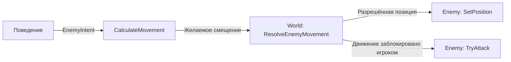

# Depthline

[English](README.md) | Русский

Прототип экшен-игры с видом сверху на **C++23**, **SFML 3.1.0** и **CMake**.

Depthline разрабатывается как личный проект с акцентом на переиспользуемую систему боя и композицию игровых объектов. В текущей версии реализованы ближний бой с прицеливанием мышью, преследующие игрока враги и столкновения с тайловой картой. Дальнейшее направление развития: bullet hell с дальнобойным оружием и различными паттернами стрельбы.

**Статус:** ранняя стадия разработки. Пока используются геометрические фигуры и визуализация хитбоксов атак; спрайты, интерфейс здоровья и снаряды находятся в планах.

## Что уже работает

- **Независимые движение и прицеливание:** перемещение на WASD с нормализацией диагонального движения; координаты мыши переводятся в координаты мира с учётом камеры.
- **Ближний бой:** меч игрока создаёт пять прямоугольных хитбоксов, расположенных относительно направления прицеливания. Одна атака наносит урон каждому задетому врагу не более одного раза.
- **Контактные атаки:** преследующий враг пытается атаковать, когда игрок блокирует его движение. Попадание определяется пересечением направленного хитбокса атаки с игроком, а кулдаун ограничивает частоту ударов.
- **Здоровье и смерть:** побеждённые враги удаляются из мира. После смерти игрока обновление мира останавливается, а сцена остаётся на экране.
- **Тайловые карты:** карта задаёт стены, пол и точки появления сущностей. Движение разрешается отдельно по осям X и Y, что позволяет перемещаться вдоль препятствий.
- **Камера и отрисовка:** полноэкранный режим, следящая за игроком камера и кратковременная визуализация реальных хитбоксов атак.

На текущей карте находятся один игрок и один преследующий враг. Игрок отображается зелёным, враг красным, хитбоксы меча полупрозрачным белым, а контактной атаки пурпурным.

## Управление

| Ввод | Действие |
| --- | --- |
| W / A / S / D | Перемещение |
| Мышь | Прицеливание |
| Левая кнопка мыши | Атака; при удержании повторяется по мере завершения кулдауна |
| Системное сочетание клавиш для закрытия окна | Выход |

На Left Shift зарезервирован ввод для рывка, но сама механика ещё не реализована. Меню паузы и перезапуска пока нет; после смерти нужно закрыть и снова запустить приложение.

## Сборка и запуск

Инструкция ниже рассчитана на Linux. Текущая конфигурация CMake использует флаги предупреждений GCC/Clang; сборка на других платформах не проверена.

### Требования

- Компилятор C++ и стандартная библиотека с поддержкой C++23, а также компилятор C для зависимостей.
- CMake версии **3.28 или новее**, Git и Make либо Ninja.
- Графическое окружение с поддержкой OpenGL.
- Системные библиотеки и заголовочные файлы для сборки SFML: X11, Xrandr, Xcursor, Xi, udev, OpenGL, FreeType, HarfBuzz, FLAC, Ogg и Vorbis. Названия пакетов зависят от дистрибутива; подробности приведены в [инструкции по сборке SFML 3.1](https://www.sfml-dev.org/tutorials/3.1/getting-started/build-from-source/#installing-dependencies).

CMake загружает SFML через `FetchContent` с закреплённым тегом `3.1.0`, поэтому устанавливать саму SFML отдельно не требуется. Для первоначальной конфигурации нужен доступ к интернету, чтобы загрузить зависимости. Сейчас проект использует модули SFML Graphics и Audio; сборка сетевого модуля отключена.

### Команды

```sh
git clone https://github.com/Arsushaaa/MyGame.git Depthline
cd Depthline

mkdir -p assets
cmake -S . -B build -DCMAKE_BUILD_TYPE=Release
cmake --build build
./build/bin/Depthline
```

Каталог `assets` сейчас пустой и не хранится в Git. Его нужно создать, поскольку после сборки CMake копирует этот каталог рядом с исполняемым файлом. Для текущего прототипа внешние текстуры и шрифты не требуются.

Для отладочной сборки укажите `-DCMAKE_BUILD_TYPE=Debug` при конфигурации. CMake также создаёт `build/compile_commands.json` для инструментов редактора. Если существующий каталог сборки использует другой генератор, выберите новый каталог, чтобы не переиспользовать несовместимый кэш.

## Архитектура

Игровые объекты используют композицию: поведение, внешний вид, границы столкновений и оружие врага настраиваются отдельно. Фабрики собирают конкретные комбинации компонентов, а `World` координирует взаимодействие сущностей.

| Модуль | Ответственность |
| --- | --- |
| [`Game`](src/Core/Game.cpp) | Владеет окном, игровым циклом и камерой; переводит координаты мыши в координаты мира |
| [`PlayerCommand`](include/Depthline/Input/PlayerCommand.hpp) | Передаёт состояние ввода и точку прицеливания из слоя ввода в мир |
| [`World`](src/World/World.cpp) | Владеет игроком, врагами и картой; разрешает движение, применяет результаты атак и удаляет побеждённых врагов |
| [`TileMap`](src/World/TileMap.cpp) | Проверяет данные карты, извлекает точки появления, рисует тайлы и проверяет столкновения со стенами |
| [`Player`](src/Entities/Player.cpp) | Хранит состояние игрока и владеет его оружием |
| [`Enemy`](src/Entities/Enemy/Enemy.cpp) | Хранит состояние врага, делегирует принятие решений компоненту поведения и владеет компонентами и оружием |
| [`Weapon`](src/Entities/Weapon/Weapon.cpp) | Координирует создание атак, ограничения использования и визуальные эффекты |

### Состав врага

Враг объединяет реализации трёх интерфейсов из [`EnemyComponents.hpp`](include/Depthline/Entities/Enemy/EnemyComponents.hpp) и собственный `Weapon`:

| Компонент | Назначение | Текущая реализация |
| --- | --- | --- |
| Поведение | Формирует `EnemyIntent` с направлениями движения и прицеливания | `ChaserBehavior` |
| Визуал | Отображает врага и получает обновления позиции и направления взгляда | `RectangleEnemyVisual` |
| Коллайдер | Возвращает границы сущности в предполагаемой позиции | `BoxEnemyCollider` |

Выбор направления движения и проверка возможности пройти разделены:



Поведение получает `EnemyBehaviorContext` с позициями врага и цели, а также временем кадра. Оно не перемещает врага и не наносит урон самостоятельно. `World` проверяет столкновения с картой и игроком, прежде чем разрешить запрошенное движение.

### Общая система оружия

Игрок и каждый враг владеют собственным `Weapon`. Его три компонента описаны в [`WeaponComponents.hpp`](include/Depthline/Entities/Weapon/WeaponComponents.hpp):

| Компонент | Ответственность | Текущие реализации |
| --- | --- | --- |
| `IWeaponAttackPattern` | Создаёт хитбоксы и задаёт урон, используя позицию, границы и направление прицеливания владельца | `BaseSwordPattern`, `ContactAttackPattern` |
| `IWeaponUseLimiter` | Определяет, можно ли применить оружие, и обновляет кулдаун | `CooldownLimiter` |
| `IWeaponVisual` | Отображает оружие или эффект атаки | `HitboxAttackVisual` |

Атака выполняется в следующем порядке:

1. Владелец формирует `WeaponUseContext` и вызывает `Weapon::TryUse()`.
2. Ограничитель проверяет готовность оружия. Если использовать его нельзя, `TryUse()` возвращает `std::nullopt`.
3. Паттерн атаки создаёт `WeaponAction` с хитбоксами и значениями урона.
4. Ограничитель запускает кулдаун, а визуал получает то же действие через `OnUse(action)`.
5. Владелец возвращает действие в `World`, который проверяет попадания и применяет урон.

Геометрия атаки вычисляется в одном месте: отладочный визуал рисует хитбоксы, созданные паттерном атаки. Урон рассчитывается однократно при обработке действия; таймер отображения не приводит к повторному нанесению урона.

### Владение и расширение

Компоненты хранятся в `std::unique_ptr`, явно выражая исключительное владение. `Enemy` и `Weapon` поддерживают перемещение, но запрещают копирование: их состояние и компоненты передаются, а не дублируются. Фабрики сосредоточивают выбор компонентов и их параметров в одном месте.

- Для нового поведения врага нужно реализовать `IEnemyBehavior` и выбрать его в [`EnemyFactory`](src/Entities/Enemy/EnemyFactory.cpp). Существующие визуалы, коллайдеры и оружие можно использовать повторно.
- Для нового оружия с хитбоксами нужно реализовать `IWeaponAttackPattern` и собрать оружие в [`WeaponFactory`](src/Entities/Weapon/WeaponFactory.cpp). Ограничитель кулдауна и визуал хитбоксов могут остаться прежними.
- Для отрисовки спрайтов можно добавить новую реализацию визуала, сохранив существующее поведение или паттерн атаки.

Сейчас `WeaponAction` поддерживает прямоугольные хитбоксы. Для дальнобойного оружия также потребуется создание и обновление снарядов в мире. Типы SFML используются в интерфейсах игровой логики; отдельного слоя симуляции, независимого от библиотеки отрисовки, пока нет.

## Структура проекта

```text
app/main.cpp                     Точка входа в приложение
include/Depthline/               Объявления классов и интерфейсов
    Core/                       Игровой цикл и окно
    Input/                      Команды ввода и привязки управления
    World/                      Мир, тайловая карта и определения уровней
    Entities/                   Игрок
        Enemy/                  Компоненты врага и фабрика
        Weapon/                 Компоненты оружия и фабрика
src/                            Реализации с той же структурой, что и include/Depthline
CMakeLists.txt                  Конфигурация сборки и зависимости
```

Уровень задаётся в [`Maps.hpp`](include/Depthline/World/Maps.hpp): `#` обозначает стену, `.` пол, `P` точку появления игрока, `E` точку появления преследующего врага. Строки карты должны иметь одинаковую длину, а точка появления игрока должна быть ровно одна. Некорректные карты отклоняются с исключением. Изменение карты пока требует перекомпиляции.

## Ограничения и планы

Пока реализовано только преследование игрока. Значения `Shooter` и `Jumper` зарезервированы в перечислении, но используют ту же конфигурацию фабрики. Враги движутся прямо к игроку без поиска пути. Проверки столкновений дискретные, поэтому до добавления быстрых снарядов потребуется доработать обработку высоких скоростей и больших интервалов между кадрами.

Планы развития:

- Интерфейс здоровья, экран смерти и перезапуск игры.
- Дальнобойное оружие, жизненный цикл снарядов и паттерны стрельбы врагов.
- Дополнительные поведения врагов и конфигурации оружия.
- Спрайты и анимации атак с сохранением существующего визуализатора хитбоксов.
- Автоматические тесты валидации карт, кулдаунов, геометрии атак и обработки урона, затем сборки в CI.

Автоматические тесты и CI пока не добавлены в репозиторий.
